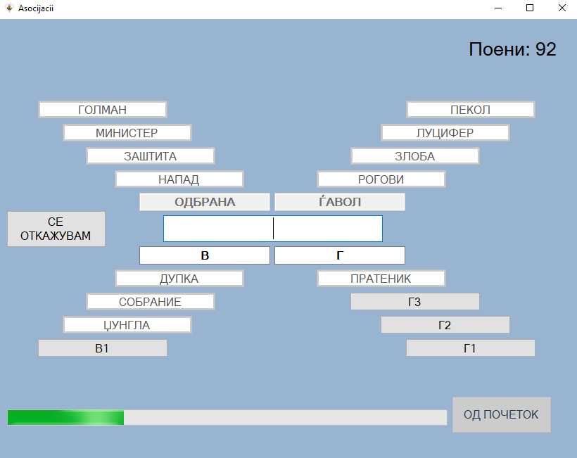

# Сложувалка
## Опис на апликацијата
Оваа игра содржи 6 уникатни мини игри за проверка на основно знаење. Идејата за истата ја добив од српскиот квиз Slagalica за кој повеќе информации можете да најдете на следниот линк: http://www.slagalica.tv/game/.
## Опис на проблемите, решение и правила за играње
Бидејќи се работи за 6 различни мини игри, секоја игра има различни проблеми со кои треба да се справува.  

### Почетна форма
  
Со клик на ПОЧЕТОК ја стартувате играта. Во делот ПРАВИЛА се испишани сите правила поврзани со игрите. ИЗЛЕЗ ја исклучува апликацијата.  
### Игра број 1 (Сложувалка)
  
Сложувалка е игра со букви. Имате понудено 12 букви и треба преку пермутација на истите да добиете што е можно подолг збор. Секоја искористена буква во зборот носи 1 поен. Доколку го пронајдете најдолгиот можен збор добивате бонус 5 поени. Дозволен е секаков облик на зборови.  
**КАКО СЕ ИГРА?**  
Со левиот клик на глувчето одбирате буква која сакате да ја додадете во зборот. Со притискање на копчето ИЗБРИШИ ја бришете последната одбрана буква. Кога ќе го внесите вашиот збор, кликнете на копчето ПОГОДИ. Имате 100 секунди. Во случај ако времето ви истече, во предвид се зема зборот кој моментално го имате составено.  

Во оваа форма е дефинирана целна променлива ```score``` која е од ```public``` и сите други класи и функции можат да ја читаат, инкрементираат и декрементираат.  

Главните податоци за оваа игра се чуваат во ```public class GameOne```, односно буквите ```public Char[] letters { get; set; }``` и речникот на валидни зборови ```public HashSet<String> dictonary { get; set; }```.  
При кликнување на копчето погоди се повикува функцијата ```public void endOfGame()```
```
private void endOfGame()
        {
            this.btnLetter1.Enabled = false;
            this.btnLetter2.Enabled = false;
            this.btnLetter3.Enabled = false;
            this.btnLetter4.Enabled = false;
            this.btnLetter5.Enabled = false;
            this.btnLetter6.Enabled = false;
            this.btnLetter7.Enabled = false;
            this.btnLetter8.Enabled = false;
            this.btnLetter9.Enabled = false;
            this.btnLetter10.Enabled = false;
            this.btnLetter11.Enabled = false;
            this.btnLetter12.Enabled = false;
            this.btnGuess.Enabled = false;
            this.btnRemove.Enabled = false;
            this.btnNextGame.Enabled = true;
            this.timer1.Stop();
            this.progressBar1.Enabled = false;
            if (g1.dictonary.Contains(word))
            {
                score += this.word.Length;
                if (score == 12)
                    score += 5;
                this.lScore.Text = score.ToString();
            }
            else
            {
                MessageBox.Show("Зборот не постои во македонскиот речник");
            }           
        }
```
Кога ќе се повика оваа функција сите копчинња се оневозможуваат и се проверува дали внесениот збор постои во речникот. Доколку постои, се доделуваат поени соодветно, а доколку не постои, се појавува порака која го известува корисникот дека зборот не постои. После оваа функција само копчето СЛЕДНО е овозможено кое ве носи на следната игра.

### Игра број 2 (Мој број)
  
Мој број е игра со броеви. Компјутерот по случаен избор избира еден цел број од 100 до 999, како и 6 помали броеви. Вие треба да ги искомбинирате тие 6 броеви со помош на математичките операции (собирање, одземање, множење и делење) за да го добието бараниот број. Поените се делат на следниот начин:  
 - 30 поени ако најдете формула преку која се добива бараниот број
 - 15 поени ако разликата меѓу добиенот и бараниот број е 1
 - 10 поени ако разликата е помеѓу 2 и 10
 - 5 поени ако разликата е помеѓу 11 и 50
 - 1 поен ако разликата е поголема од 50  
 
**КАКО СЕ ИГРА?**  
Со левиот клик од глувчето бирате броеви и математички операции кои сакате да ги додадете во формулата. Со опцијата ИЗБРИШИ го бришете последниот внесен број или операција. Со клик на копчето ПРЕСМЕТАЈ, се пресметува вашиот израз и ви се доделуваат поени. Имате 1 обид. Времето е ограничено на 100 секунди. Во случај времето да ви истече, во предвид се зема изразот кој моментално го имате составено.

Во следната функција се генерираат броевите по случаен избор.
```
private void MojBroj_Load(object sender, EventArgs e)
        {
            Random rand = new Random();
            this.lNumber.Text = rand.Next(100, 999).ToString();
            this.btnNumber1.Text = rand.Next(1, 9).ToString();
            this.btnNumber2.Text = rand.Next(1, 9).ToString();
            this.btnNumber3.Text = rand.Next(1, 9).ToString();
            this.btnNumber4.Text = rand.Next(1, 9).ToString();
            int[] niza = { 10, 15, 20 };
            this.btnNumber5.Text = niza[rand.Next(0, 2)].ToString();
            int[] niza2 = { 25, 50, 75, 100 };
            this.btnNumber6.Text = niza2[rand.Next(0, 3)].ToString();
            this.btnAdd.Text = "+";
            this.btnSubtract.Text = "-";
            this.btnMultiply.Text = "*";
            this.btnDivide.Text = "/";
            this.btnLeftBracket.Text = "(";
            this.btnRightBracket.Text = ")";
            this.lScore.Text = gameOne.score.ToString();
            this.btnNextGame.Enabled = false;
            this.timer.Start();
        }
```
Изразот што го внесува корисникот се пресметува со помош на класата ```EvaluateString``` која работи исклучиво со стекови.

### Игра број 3 (Спојки)
  
Спојки е игра со зборови. Во две колони се прикажани по 8 зборови. Секој збор од левата колона има свој пар во десната колона. За секој споен пар добивате 2 поени.  
**КАКО СЕ ИГРА?**  
Во даден момент треба да го изберете десниот пар на зборот кој е обележен со жолто од левата колона. Зборот го бирате со лев клик на истиот. Ако го погодите, паровите светнуваат зелени. Ако го згрешите, левиот збор светнува црвено. Имате 60 секунди.  

Осумте парови се чуваат во речникот ```Dictionary<String, String> dic```. При вчитување на играта се повикува функцијата ```loadPairs()``` која ги меша паровите по случаен избор. При секој обид се повикува функцијата ```guess()``` која проверува дали е споен валиден пар.

### Игра број 4 (Скочко)
  
Скочко е игра со знаци. Компјутерот по случаен избор избира комбинација од 4 знаци која треба да се погоди. Знаковите се бираат од купчето од 6 знакови, а одреден знак може да се појави и повеќе пати. Имате 6 обиди да ја погодите комбинацијата, а после секој обид компјутерот ви покажува колку знакови сте погодиле и колку од нив се на правата позиција. За успешно наоѓање на комбинацијата добивате 30 поени.  
**КАКО СЕ ИГРА?**  
Со левиот клик на глувчето одбирате знак за секое поле во кое што нема знак. Во случај да сте избрале лош знак, можете да го избришите со кликнување на копчето ИЗБРИШИ. Кога ќе ги одберете сите 4 знаци, кликнете на копчето ПРОВЕРИ. Семафорите ќе ви покажат колку знакови сте погодиле. За знаковите кои се на правото место ќе светне црвен семафор, а за оние кои се на погрешно место, жолт семафор. Времете е ограничено на 100 секунди. Во случај времето да истече, добивате 0 поени. 

Сите знакови си имаат и позитивна целна вредност (од 1 до 6 редоследно) и со секој клик на знак на корисникот целната вредност на знакот се додава во низата ``` private int [] comb```. Иницијално сите вредности во низата се поставени на 0. Комбинацијата што треба да се погаѓа е генерирана по случаен избор и е сместена во низата ```int[] finalCombination```. При секој нов обид, вредностите во низата се менуваат во 0. Ако играчот се обиде да погоди комбинација во која нема 4 знаци, се појавува порака која го известува играчот дека му фалат вредност. При точен погодок или кога играчот не успее да ја погоди точната комбинација при 6те обиди, се повикува функцијата ```reveal()``` која ја прикажува точната комбинација во долниот лев агол од формата.

### Игра број 5 (Кој знае, знае)
  
Кој знае знае е игра за проверување на општо знаење. Компјутерот ви поставува 10 прашања и нуди по 4 можни одговори. Секој точен одговор носи 5 поени. Во случај да одговорите погрешно, губите 3 поени. Можете и да не го одговарате прашањето и да не изгубите поени.  
**КАКО СЕ ИГРА?**  
Ќе се прикаже прашањето и 4 понудени одговори. Со лев клик од глувчето го бирате вашиот одговор. Ако одговорите точно, одговорот се бои со зелена броја. Ако одговорите погрешно, вашиот одговор се бои со црвена боја, а точниот со зелена. Во случај да не го знаете одговорот можете да кликнете СЕ ОТКАЖУВАМ па да не изгубите поени ако одговорите погрешно. За секое прашање имате 10 секунди. Ако ви истече времето, се покажува точниот одговор и не добивате поени. За следно прашање кликнувате на копчето СЛЕДНО ПРАШАЊЕ.  

Прашањата и одговорите се чуваат во речникот ```private Dictionary<String, Question> questions``` каде во ```String``` се чува прашањето, а во ```Question``` се чуваат понудените одговори и точниот одговор. ```Question``` е објект од класата ```public class Question```.
Функцијата ```setQuestionPosition``` го поставува прашањето на средина од формата (функцијата ја напишав затоа што секое прашање е со различна должина).
```
private void setQuestionPosition()
        {
            this.lQuestion.Text = quest[this.index];
            int width = int.Parse(this.lQuestion.Size.Width.ToString());
            int positionX = (841 - width) / 2;
            this.lQuestion.Left = positionX;

            this.lNumOfQuestion.Text = (this.index + 1).ToString() + ".";

            int widthNum = int.Parse(this.lNumOfQuestion.Size.Width.ToString());
            this.lNumOfQuestion.Left = positionX - widthNum;
        }
```
Функцијата ```loadQuestion()``` се повикува со секое кликање на копчето СЛЕДНО ПРАШАЊЕ и генерира ново прашање.
Функцијата ```findCorrectAnswer``` се повикува кога кога играчот се откажал од одговарање на прашањето, му истекло времето за одговарање или играчот избрал погрешен одговор. Оваа функција го прикажува точниот одговор така што го бои со зелена боја.

### Игра број 6 (Асоцијации)
  
Во оваа игра прво треба да се решат четирите споредни асоцијации, а потоа со помош на добиените 4 поими да ја решите главната асоцијација. Решението на секоја асоцијација е некој поим на кој асоцираат четири поими во неговата колона. На почетокот сите поими се скриени, и играчот открива еден по еден. Имате неограничен број на обиди. Во секој момент можете да погаѓате главна или споредна асоцијација. За решение на споредна асоцијација се добива 2 поени плус бројот на неоткриени поими во неговата колона помножен по 2. За решение на главната асоцијација се добива 10 поени.  
**КАКО СЕ ИГРА?**  
Со левиот клик на глувчето бирате поле. Во секој момент можете да погаѓате решение. **ТЕКСТОТ СЕ ВНЕСУВА ИСКЛУЧИВО СО МАКЕДОНСКА ПОДДРШКА** па со притискање на ENTER правите обид. Не се разликува мала и голема буква. Во случај да не можете да го погодите решението, а не сакате да чекате да помине времето, можете да ја изберете опцијата СЕ ОТКАЖУВАМ. Имате 120 секунди.  

Сите текстуални полиња ги имаат евентите Enter, Leave, Key_down што го подобруваат "User experience". При точен одговор за дадена колона, копчињата и текстуалното поле се оневозможуваат и се прикажуваат нивните вредности. При погрешен одговор, текстуалното поле каде што се наоѓа играчот се менува во празен стринг. При точен одговор на главната асоцијација сите неотриени полиња се откриваат и сите можности се оневозможуваат освен копчето ОД ПОЧЕТОК кое ве враќа назад за играње на играта од почеток.

### TO-DO list
- [x] Fix bugs
- [ ] Big refactor on the code because it is a mess :(
- [ ] Add database with more questions
- [ ] Add more unique games
- [ ] Add duel mode with 2 players
- [ ] Add more questions to the database

### Владимир Стојчески, 171248
